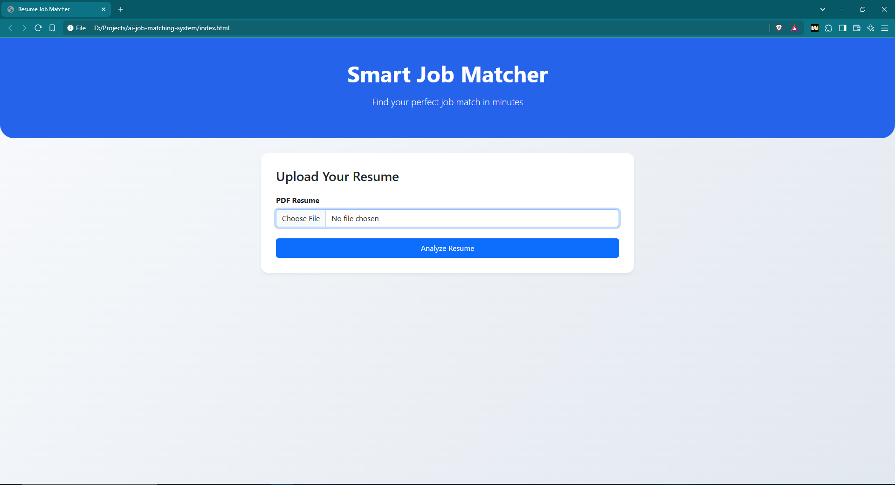
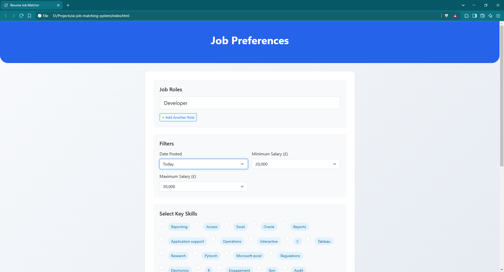
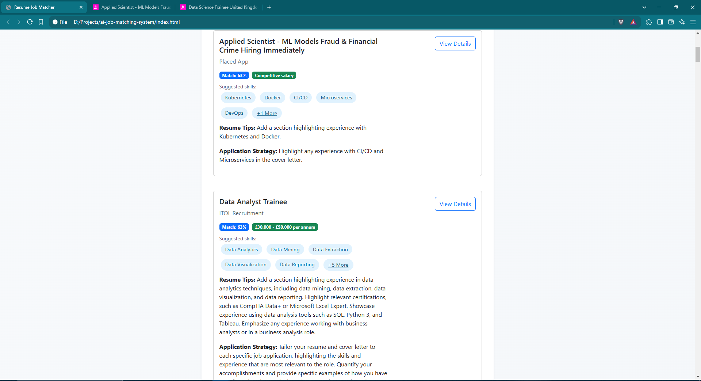

# AI-Powered Job Matching System

A web-based platform that automatically matches a candidate's resume with real-time job listings from [Reed.co.uk](https://www.reed.co.uk). This system uses advanced NLP models for skill extraction and semantic similarity to provide highly relevant job recommendations, along with personalized resume improvement suggestions.

---

## Features

- **Resume Parsing & Skill Extraction**  
  Uses [PyResparser](https://github.com/OmkarPathak/pyresparser) to analyze PDF resumes and extract key skills.

- **Semantic Similarity Scoring**  
  Employs the [Sentence Transformers](https://www.sbert.net/) model ( `BAAI/bge-large-en` ) to compute contextual matches between resume content and job descriptions.

- **Real-Time Job Scraping**  
  Scrapes [Reed.co.uk](https://www.reed.co.uk) using [Playwright](https://playwright.dev/) for the latest openings based on user-defined roles, skills, and filters.

- **Generative AI Suggestions**  
  Integrates [Google Generative AI (gemini-pro)](https://ai.google/) to recommend missing keywords, resume improvements, and application tips for top-matching jobs.

- **Interactive Web UI**  
  Built with HTML/CSS/Bootstrap to allow users to upload their resume, select roles/skills, apply filters, and visualize the top 50 matching positions in one place.


## 🖥️ Application Preview

Below are screenshots showing the workflow and user interface of the **AI-Powered Job Matching System**.

### 1. 📄 Resume Upload Page
Users can upload their PDF resumes to start the analysis process.



---

### 2. 🔍 Job Preferences and Filters
After resume analysis, users select their preferred job roles, apply date and salary filters, and highlight key skills they want to emphasize.



---

### 3. 🎯 Matching Results & Recommendations
The system displays top job matches with:
- **Match Percentage**
- **Suggested Skills**
- **Resume Improvement Tips**
- **Personalized Application Strategies**

Users can directly navigate to the job postings or download the full results as a CSV file.



## Tech Stack

- **Backend & Scraping:** Python, Playwright, PyPDF2, NLTK, PyResparser
- **NLP & ML:** Sentence Transformers, scikit-learn (TF-IDF), Google Generative AI (gemini-pro)
- **Web Interface:** HTML/CSS/Bootstrap, JavaScript
- **Server:** Python’s built-in `http.server`

---

## Prerequisites

- **Python** 3.9 or above
- **Pip** (Python package manager)
- A **Google Generative AI API key** (for gemini-pro).

By default, `job_scraper.py` contains a placeholder line:

```python
genai.configure(api_key="YOUR_API_KEY_HERE")
```

Make sure to replace "YOUR_API_KEY_HERE" with your actual key.

## Prerequisites

You may also need NLTK’s stopwords downloaded. In a Python shell:

```bash
python -m nltk.downloader stopwords
```

## Installation

### 1. Clone this repository (or download and unzip):
```bash
git clone https://github.com/YourUsername/ai-job-matching-system.git
cd ai-job-matching-system
```

### 2. Install dependencies:
```bash
pip install -r requirements.txt
```

### 3. Configure your API key in `job_scraper.py`:
```python
genai.configure(api_key="YOUR_API_KEY_HERE")
```

### 4. (Optional) Adjust concurrency or scraping delays within `job_scraper.py` if needed:
```python
MAX_SCRAPER_WORKERS = 4  # Number of parallel scrapers for job listings
MAX_DESC_WORKERS = 8  # Number of parallel scrapers for job descriptions
REQUEST_DELAY = 1.5  # Delay (seconds) between requests
```

---

## Usage

### 1. Start the local server:
```bash
python processor.py
```
The server runs by default at `http://localhost:8000`.

### 2. Open the interface:
- Open `index.html` in your browser, or
- Go to `http://localhost:8000` (if you serve the static files separately).

### 3. Upload Resume:
- On the upload page, select a PDF resume.
- Click **Analyze Resume** to extract your skills.
### 4. Select Roles & Filters:
- Choose desired job roles, filters (date posted, salary range), and confirm any skills you want to emphasize.

### 5. View Matching Jobs:
- After scraping, the system displays the top matching jobs (up to 50).
- Each listing includes:
  - Match percentage
  - Missing keywords/skills
  - Resume tips & application strategies (AI-generated)
  - Direct link to the job posting

### 6. Download CSV (Optional):
- Click **Download Full Results (CSV)** to export all processed jobs (`all_jobs.csv`).

---

## Project Structure

```bash
├── job_scraper.py     # Core logic for scraping, NLP, and AI-based suggestions
├── processor.py       # HTTP server handling file uploads & job-finding requests
├── index.html         # Main UI for uploading resumes & showing results
├── requirements.txt   # Python dependencies (if provided)
├── README.md          # Project readme
```
